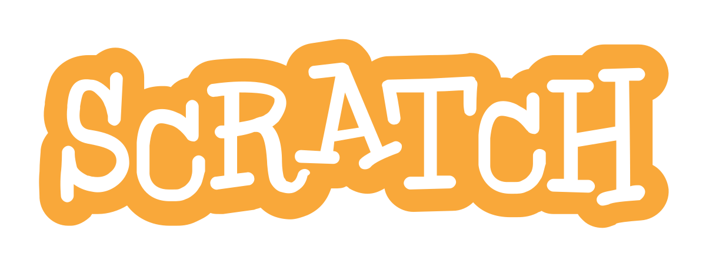
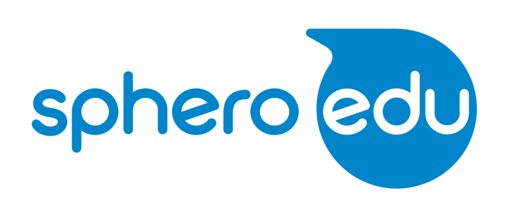

# curiouser-and-curiouser

CuriouSer was a VR educational game for the Google Pixel, where the player works in a fast food pizza restaurant in space. This project’s aim was to create an educational game which teaches introductory computer science concepts for beginners of computer science. The CuriouSer team worked through extensive research and play-testing; pushing the boundaries of Virtual Reality educational experiences. In the game, the player must cook different flavored pizzas in a specified time for Aliens.

<h2>ROLE: GAME DESIGNER & SOUND DESIGNER</h2>

Responsibilities

<ul>
  <li>Organized and participated in brainstorming design sessions.</li>
  <li>Assisted in the creation of a sample lesson plan to help teachers include this new game into their pre-existing curriculum.</li>
  <li>Collaborated based on education professionals project needs to comfirm information taugh was concise and accurate</li>
  <li>Organized play-tests and feedback sessions from play-testers of all ages, primarily between middle and high school students.</li>
</ul>

<h2>SOFTWARE & HARDWARE</h2>

Software

<ul>
  <li>Unity</li>
  <li>Perforce</li>
  <li>Logic Pro X</li>
  <li>Adobe Audition</li>
  <li>Reaper</li>
</ul>

Hardware

<ul>
  <li>Google Pixel (XL)</li>
  <li>Google DayDream</li>
</ul>

<h3>Watch a demonstration!</h3>

Click the picture below

<h1>FULL PROCESS</h1>

<h2>Contents</h2>
<ul>
  <li>Problem, Goal, Solution</li>
  <li>Research</li>
  <li>Brainstorming & Concept</li>
  <li>Cosmic Kitchen Concept</li>
  <li>The Cook-o-Matic</li>
</ul>

<h2>PROBLEM, GOAL, AND SOLUTION</h2>

<table>
  <tr>
    <th>Problem</th>
    <th>Goal</th>
    <th>Solution</th>
  </tr>
  <tr>
    <td>Learning CS in middle and high school is not engaging or fun.</td>
    <td>To create a fun and engaging CS game which educates students on the use of methods and functions.</td>
    <td>Create a virtual reality CS alien-space cooking game where the primary objective is making pizzas through creating “function” presets.</td>
  </tr>
</table>

CuriouSer was an academic project created over the course of a semester. My team and I were partnered with our Client <a href="http://www.alice.org/">Alice</a> who is a subsidiary of Carnegie Mellon University. Specializing in Computer Science education, a representative came to us and requested we make a game facilitating CS education within schools though what we decided to teach in our game was entirely up to us. So we started researching…

<h2>RESEARCH</h2>
<table>
  <tr>
    <td></td>
    <td></td>
    <td>
  </tr>
  <tr>
    <td align="center">Code.org</td>
    <td align="center">Scratch Code</td>
    <td align="center">Sphero Coding Robotics</td>
  </tr>
</table>

Over the first two weeks of the project we examined many resources that already had proven to teach CS well. However, we were specifically tasked of making a game that teaches CS that was "Fun". Though our resources were excellent at educating, we felt they lacked entertainment. The next thing for us to do was to discuss with educators what the methods they already use to teach CS were, how they keep their student engaged, and how they assess student learning.

<h3>Teacher Quote</h3>

"The real struggle is keeping the students engaged. All of the students are very talented and receptive so it's the teachers job to engage with the students. Discover about who they are, what they like, and then bring that back around into the lesson."

The team and I started visiting schools and conversing with teachers about their needs alongside their students needs. We wanted to know what aspects of the teachers experience we could make easier while maintaining effectiveness. We discovered the most important aspects were...

<ul>
  <li>Engagement</li>
  <li>Knowledge Acquisition</li>
  <li>Assessment</li>
</ul>

Because of our findings above we determined the next steps would be to decide exactly what we will be teaching in the game. With endless possibilities, where do we even start? We revisited the programs we'd been referencing to see exactly what they were teaching and when within their courses curricula. After revisiting teachers we consolidated our findings...

<table>
  <td>
    <ul>
      <li>Debugging</li>
      <li>Infrastructure</li>
      <li>Functions / Methods</li>
      <li>Variables</li>
    </ul>
  </td>
  <td>
    <ul>
      <li>A little abstract for Middle Schoolers.</li>
      <li>Excellent to learn early, if possible.</li>
      <li>Versatile, but hard to master.</li>
      <li>Useful, but is this the best use of the resource?</li>
    </ul>
  </td>
</table>
  
  
