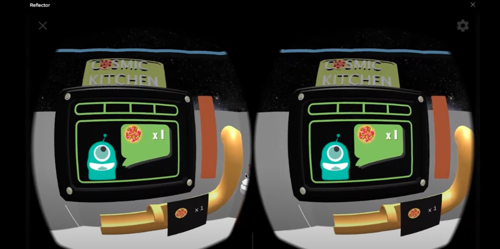

# curiouser-and-curiouser

CuriouSer was a VR educational game for the Google Pixel, where the player works in a fast food pizza restaurant in space. This project’s aim was to create an educational game which teaches introductory computer science concepts for beginners of computer science. The CuriouSer team worked through extensive research and play-testing; pushing the boundaries of Virtual Reality educational experiences. In the game, the player must cook different flavored pizzas in a specified time for Aliens.

<h2>ROLE: GAME DESIGNER </h2>

Responsibilities

<ul>
  <li>Organized and participated in brainstorming design sessions.</li>
  <li>Assisted in the creation of a sample lesson plan to help teachers include this new game into their pre-existing curriculum.</li>
  <li>Collaborated based on education professionals project needs to comfirm information taugh was concise and accurate</li>
  <li>Organized play-tests and feedback sessions from play-testers of all ages, primarily between middle and high school students.</li>
</ul>

<h2>SOFTWARE & HARDWARE</h2>

Software

<ul>
  <li>Unity</li>
  <li>Perforce</li>
</ul>

Hardware

<ul>
  <li>Google Pixel (XL)</li>
  <li>Google DayDream</li>
</ul>

